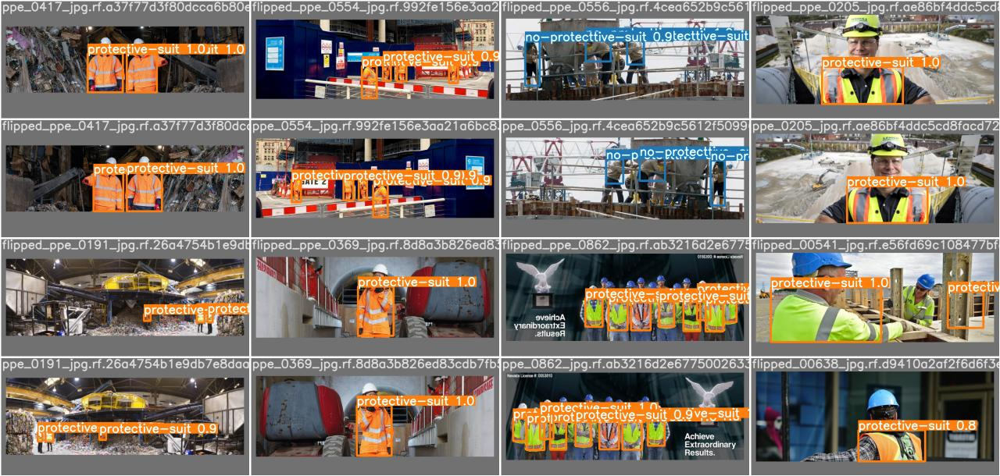
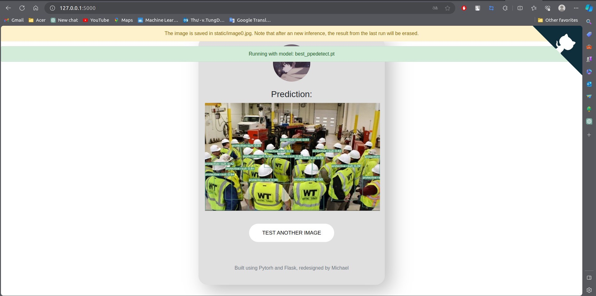

# PPE Detection and Deployment with YOLOv7 and Flask


## Introduction

This project focuses on implementing a computer vision solution for detecting Personal Protective Equipment (PPE) using the YOLOv7 object detection model. The primary objective is to enhance workplace safety by identifying and localizing essential PPE components in images and video streams.


## Usage
Using conda environment is recommended. Follow these steps to get the code running :
### Installation
```python
git clone https://github.com/thanhtungdo2211/PPE_Detection_WebdeploybyFlask.git
cd PPE_Detection_WebdeploybyFlask
conda create --name ppe-detection python=3.7
conda activate ppe-detection
pip3 install -r requirements.txt
```
### Inference 
```python
python python detect.py --weights best_ppedetect.pt --conf 0.5 --img-size 640 --source yourimage.jpg
```
### Deploy 
```python
cd web_deploy
FLASK_ENV=development FLASK_APP=app.py flask run
```
## Result
<div align="center">
    <a href="./">
        
    </a>
</div>
<div align="center">
    <a href="./">
        
    </a>
</div>
## References
Thanks to the authors:
[YOLOv7](https://github.com/WongKinYiu/yolov7)
[Flask](https://github.com/Michael-OvO/Yolov7-Flask)
